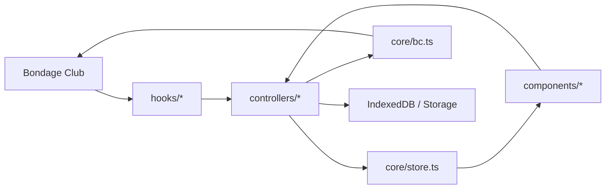
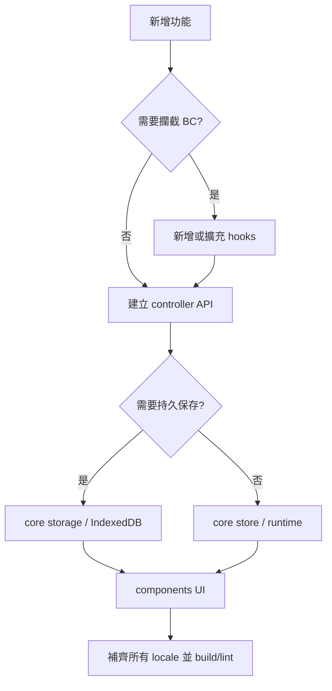

# AEE 架構與擴充指南

互動版功能分支圖：[開啟 AEE 架構圖](./aee-architecture.html)

左側依功能分類選擇；右側束狀圖依序顯示功能、模組責任與實際檔案。點擊任一模組或檔案節點，下方會列出完整路徑與可開啟的檔案連結。

## 總體資料流

| 層級 | 責任 | 不應處理 |
|---|---|---|
| `hooks/` | 攔截 BC 生命週期、繪製與輸入，建立必要上下文 | 大量 UI 或業務規則 |
| `controllers/` | 功能規則、互動流程、BC 副作用 | React 元件與持久層實作 |
| `core/` | Store、型別、BC Property adapter、設定與持久資料能力 | 畫面排版 |
| `components/` | React 顯示、表單與 Overlay | 直接修改 BC Property |
| `util/` | 無狀態或低副作用的共用轉換 | 功能狀態機 |

## 主要功能入口

- 外觀控制列：`components/ToolbarSide.tsx` → `controllers/uiController.ts` → `core/bc.ts`
- 部件圖示與拾取：`components/parts-browser/*` → `controllers/appearancePickerController.ts` → `hooks/drawingHooks.ts`
- 任意變形：`components/overlays/FreeTransformGizmo.tsx` → `controllers/layerGeometryController.ts` → `appearancePickerController.ts`
- 旋轉：`components/overlays/RotationOverlay.tsx` → `controllers/uiController.ts` → `core/bc.ts`
- 圖層管理：`components/layer-manager/*` → `controllers/layerManagerController.ts`
- 檢視與背景：`components/view-controls/*` → `controllers/viewController.ts` / `backgroundController.ts`
- 自由繪圖：`features/mask/index.ts` → `components/mask-system/freeDraw/index.ts`
- 專屬衣櫃：`components/wardrobe/WardrobeScreen.tsx` → `controllers/wardrobeController.ts` → `core/wardrobeStore.ts`

## 變形幾何規則

任意變形功能參考並改寫自 **星漣 XinLian132243 / BCMod** 的圖層變形工具。

1. `drawingHooks.ts` 在 `GLDrawImage` 邊界取得 BC 實際繪製輸入。
2. `appearancePickerController.ts` 保留兩種 capture：多張資料供拾取/縮圖；每實體層一張穩定資料供變形幾何。
3. 單層 pivot 必須重現 BC 的 WebGL 矩陣，不可使用 alpha bounds 或可見矩形中心推測。
4. 整件物品 Rotation 由 BC 分別套到每個實體圖層；沒有整件共用 pivot。`layerGeometryController.ts` 聚合外框，但保留所有實體層 pivot。
5. Overlay 只消費幾何結果，不重算 BC 座標。

## 新功能放置判斷

新增模組時，優先建立單一公開入口；避免 UI 跨越 Controller 直接呼叫 Hook，也避免不同功能各自複製 BC Property 的讀寫規則。

## 文件索引

- [外觀拾取與懸停](./appearance-picking-and-hover.md)
- [自由繪圖遮罩](./free-draw-mask.md)
- [SPS 自由繪圖](./sps-free-draw.md)
- [圖層隱藏](./layering-hide.md)
- [圖示管理](./icon-organization.md)
- [未完成項目](./unfinished-items.md)
