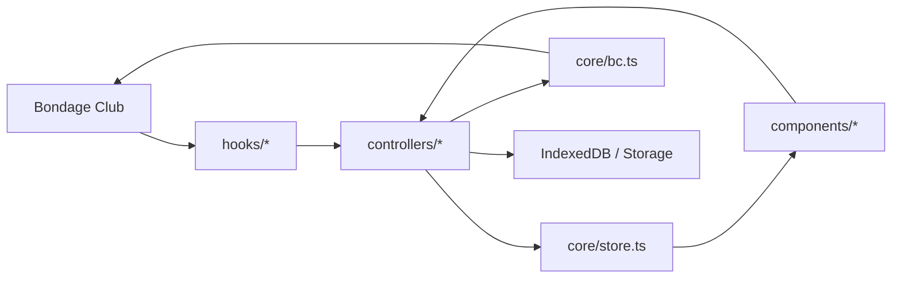
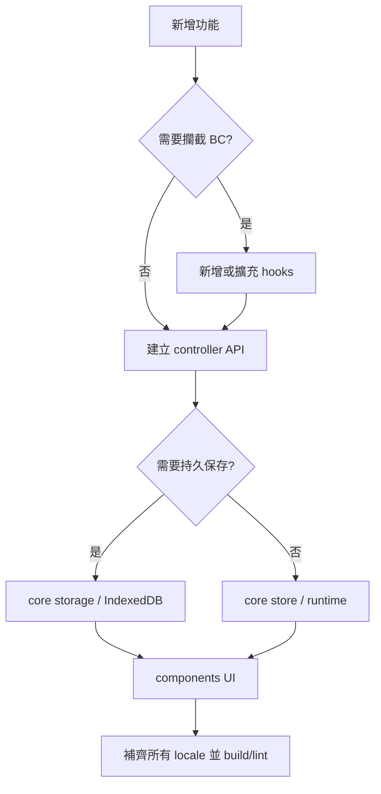

# AEE 架構與擴充指南

[文件索引](../README.md) · [互動架構圖](https://awdrrawd.github.io/BC-AEE/docs/architecture/index.html)

互動版功能分支圖：[開啟 AEE 架構圖](https://awdrrawd.github.io/BC-AEE/docs/architecture/index.html)

相容性例外：[頭髮與五官變形白名單及退場規則](../持續追蹤/transform-whitelist.md)

左側依功能分類選擇；右側束狀圖依序顯示功能、模組責任與實際檔案。點擊任一模組或檔案節點，下方會列出完整路徑與可開啟的檔案連結。

## 啟動與實際分層

`main.tsx` 先檢查並保留 `window.Liko.AEE` 命名空間，避免重複載入，再動態匯入 `app.tsx`。後者建立 Shadow DOM、掛載 React 與拖曳捲動，最後由 `hooks/index.ts` 集中安裝遊戲整合。這個安裝入口同時協調 controller 初始化、字型、同伴偵測、遮罩與 onboarding，不只是 hooks 清單。

下表是維護方向，並非嚴格依賴規則：`core/externalStore.ts` 與 `settings.ts` 已提供 React 訂閱，`core/dialogs.tsx` 接受 ReactNode；`components/mask-system/` 仍包含非 UI 的渲染、儲存與編輯流程，`features/mask/index.ts` 目前只是公開轉匯出入口。

具體證據與分階段建議見[架構檢查與調整順序](../代改進/architecture-review.md)。

## 總體資料流

| 層級 | 責任 | 不應處理 |
|---|---|---|
| `hooks/` | 攔截 BC 生命週期、繪製與輸入，建立必要上下文 | 大量 UI 或業務規則 |
| `controllers/` | 功能規則、互動流程、BC 副作用 | React 元件與持久層實作 |
| `core/` | Store、型別、BC Property adapter、設定與持久資料能力 | 畫面排版 |
| `components/` | React 顯示、表單與 Overlay | 直接修改 BC Property |
| `util/` | 無狀態或低副作用的共用轉換 | 功能狀態機 |

## 執行期攔截原則

AEE 不使用 ModSDK `patchFunction` 的字串取代。遊戲函式擴充一律使用可串接的 `hookFunction`。遮罩系統原本名為 `installImagePatch` 的流程實際只安裝 `GLDrawLoadImage`、`DrawGetImage` 與 `GLDrawAppearanceBuild` hooks，現已改名為 `installImageHooks`。

有兩處直接覆寫瀏覽器 prototype，屬於正式渲染邊界而非測試補丁：`renderHooks.ts` 攔截 WebGL matrix/draw call，以實作斜切、鏡像副本與精準拾取；`backgroundController.ts` 在啟用自訂背景期間攔截 canvas `drawImage`，離開畫面即還原原函式。BC 沒有提供對等 hook，兩者都保存原函式並限制作用範圍。背景攔截有畫面離開時的還原流程；WebGL 包裝目前保留至頁面工作階段結束，不能將離開外觀畫面描述為插件卸載。整體尚未提供統一的 dispose 入口。

## 主要功能入口

- 外觀控制列：`components/ToolbarSide.tsx` → `controllers/uiController.ts` → `core/bc.ts`
- 部件搜尋器：`components/ToolbarSide.tsx` → `components/asset-search/AssetPartsSearchPanel.tsx` → BC `AssetGroup` / `DrawGetImage`
- 部件圖示與拾取：`components/parts-browser/*` → `controllers/appearancePickerController.ts` → `hooks/drawingHooks.ts`
- 任意變形：`components/overlays/FreeTransformGizmo.tsx` → `controllers/layerGeometryController.ts` → `appearancePickerController.ts`
- 旋轉：`components/overlays/RotationOverlay.tsx` → `controllers/uiController.ts` → `core/bc.ts`
- 圖層管理：`components/layer-manager/*` → `controllers/layerManagerController.ts`
- 檢視與背景：`components/view-controls/*` → `controllers/viewController.ts` / `backgroundController.ts`
- 自由繪圖：`features/mask/index.ts` → `components/mask-system/freeDraw/index.ts`
- 專屬衣櫃：`components/wardrobe/WardrobeScreen.tsx` → `controllers/wardrobeController.ts` → `core/wardrobeStore.ts`

### 部件搜尋器資料流

部件搜尋器是唯讀的資產瀏覽工具，不修改人物外觀，因此保留在單一 UI 模組內，直接讀取 BC 已載入的資產註冊表與圖片快取介面，不另外建立 Controller 或持久層。

1. `ToolbarSide.tsx` 管理常駐工具列入口與面板開關。
2. `AssetPartsSearchPanel.tsx` 依 `AssetGroup` 建立服裝／互動道具索引，合併同名資產在不同部位的出現位置。
3. 搜尋同時比對 `Asset.Name`、目前語言的 `Asset.Description` 與部位描述，並提供常用繁簡字正規化及模糊字序比對。
4. 左欄以分批與延遲載入避免一次建立全部縮圖；選定資產後才優先解析其中欄的所有部件。
5. 部件圖依 BC 圖層命名、姿勢、父群組與型別候選路徑解析；`DrawGetImage` 負責相容 ECHO 等自訂資產映射。
6. 中欄與右欄使用透明像素邊界自動裁切並等比例置中；第三方圖片無 CORS 標頭時退回直接顯示，不進行 alpha 裁切。

## 變形幾何規則

任意變形功能參考並改寫自 **星漣 XinLian132243 / BCMod** 的圖層變形工具。

1. `drawingHooks.ts` 在 `GLDrawImage` 邊界取得 BC 實際繪製輸入。
2. `appearancePickerController.ts` 保留兩種 capture：多張資料供拾取/縮圖；每實體層一張穩定資料供變形幾何。
3. 單層 pivot 必須重現 BC 的 WebGL 矩陣，不可使用 alpha bounds 或可見矩形中心推測。
4. 整件物品 Rotation 由 BC 分別套到每個實體圖層；沒有整件共用 pivot。`layerGeometryController.ts` 聚合外框，但保留所有實體層 pivot。
5. Overlay 只消費幾何結果，不重算 BC 座標。

## 新功能放置判斷

新增模組時，優先建立單一公開入口；避免 UI 跨越 Controller 直接呼叫 Hook，也避免不同功能各自複製 BC Property 的讀寫規則。

## 文件與驗證維護

- 互動圖的唯一內容來源為 `docs/architecture/index.html`；`docs/aee-architecture.html` 僅保留舊網址轉跳。
- 圖中的連線表示「功能 → 責任 → 相關檔案」，不是編譯器 import 依賴圖；UI／Core 等標籤描述責任，可能與現有目錄不同。
- SVG 不設定固定 `viewBox`，與絕對定位的節點共用 CSS 像素座標。修改節點寬度、欄位或間距時須同步調整 `renderGraph()` 的端點。
- 新增／移動模組時更新圖中的 `features`、本指南及專題文件；各份 Markdown 頂部保留架構圖與索引連結。
- `npm test` 統一執行回歸腳本；`npm run check:docs`、`npm run check:i18n` 與 `npm run test:architecture` 檢查文件、翻譯及架構圖。CI 與部署條件見 [GitHub Actions 與手動設定](./github-actions.md)。
- GitHub Pages 上傳 `dist/`；`scripts/build-docs.mjs` 在 npm postbuild 把架構圖與舊路徑轉址放入 `dist/docs/`。需合併 main 並成功部署後，線上入口才會更新。其他 Markdown 與原始碼仍由 GitHub 提供。

## 文件索引

- [外觀拾取與懸停](./appearance-picking-and-hover.md)
- [自由繪圖遮罩](./free-draw-mask.md)
- [SPS 自由繪圖](./sps-free-draw.md)
- [圖層隱藏](./layering-hide.md)
- [圖示管理](./icon-organization.md)
- [未完成項目](../代改進/unfinished-items.md)
